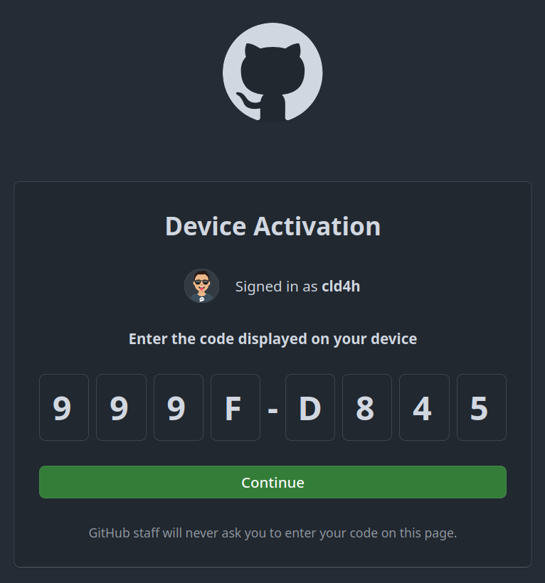

VS Code allows us to connect to a remote envirnoment. This is very convenient especially for developing and testing code on cloud computing servers.

However, [starting with VS Code release <mark>1.99 (March 2025)</mark>, the prebuilt servers distributed by VS Code are only compatible with Linux distributions that are based on glibc 2.28 or later.](https://code.visualstudio.com/docs/remote/faq#_can-i-run-vs-code-server-on-older-linux-distributions)

This create [connection problems](https://docs.alliancecan.ca/wiki/Visual_Studio_Code#The_remote_session_does_not_work_anymore) for users of [Compute Canada](https://alliancecan.ca/). Specifically, connections to Graham and Niagara because of the no longer supported CentOS7 system.

In this article, I'll show you all the steps I've done to establish a [Remote Tunnel](https://code.visualstudio.com/docs/remote/tunnels) and connect to the server.

## Official Workaround (which is not fully working)

Firstly I followed the [VS Code official documentation](https://code.visualstudio.com/docs/remote/faq#_can-i-run-vs-code-server-on-older-linux-distributions), to prepare a `sysroot`, a `patchelf` and set the three environment variables.

Long story short, it did not solve the problem but we still need these steps.

I don't want to repeate the steps mentioned in their official documentation, but several pitfalls worth mentioning:

1. Build and run the crosstool-ng command `ct-ng build` on a docker environment (the Dockerfile is provided on the [documentation](https://code.visualstudio.com/docs/remote/faq#_can-i-run-vs-code-server-on-older-linux-distributions) ), and compress the output `x86_64-linux-gnu` to send it to the server.
2. Set the 3 environment variables in `$HOME/.bash_profile` (Here I put the output from `ct-ng build` (the extracted `x86_64-linux-gnu` folder) under `$HOME/.local/share`)
```sh
export VSCODE_SERVER_CUSTOM_GLIBC_LINKER=$HOME/.local/share/x86_64-linux-gnu/x86_64-linux-gnu/sysroot/lib64/ld-linux-x86-64.so.2
export VSCODE_SERVER_CUSTOM_GLIBC_PATH=$HOME/.local/share/x86_64-linux-gnu/x86_64-linux-gnu/sysroot/lib64
export VSCODE_SERVER_PATCHELF_PATH=$HOME/.local/bin/patchelf
```

## Remote tunnels

After failure of the official workarounds from VS Code, I noticed the suggestions from [The Alliance wiki](https://docs.alliancecan.ca/wiki/Visual_Studio_Code#The_remote_session_does_not_work_anymore):

> use the "<mark>Remote Tunnels</mark>" extension by running 'code tunnel' (google <mark>vscode cli</mark> and download it). Use github or a microsoft account (OAuth) and connect to a remote vscode server, such as a niagara login node. You can have all the "benefits" of not using mfa as long as your server is running.

First thing is to download the [VS Code CLI](https://code.visualstudio.com/Download)

```sh
wget -O vscode-cli.tar.gz "https://code.visualstudio.com/sha/download?build=stable&os=cli-alpine-x64"
tar -xzvf vscode-cli.tar.gz -C $HOME/.local/bin/
rm vscode-cli.tar.gz
```

On remote server, run `code tunnel` to start.

<mark>Make sure environment variables (`echo $VSCODE_SERVER_CUSTOM_GLIBC_PATH` to check) are set</mark> from previous steps. Otherwise you'll get an error like this:


## Manually download the vscode server package

If you try to connect to the remote now, you will see the remote server keep crashing and on the remote server, vscode keeps downloading and extracting the server package.

What is the reason for this issue?

There must be some errors when we are trying to run the vscode server script.

Can we run it manually?

Here [@cvcore](https://github.com/cvcore) provided [a script for manually downloading the vscode-server](https://gist.github.com/cvcore/8e187163f41a77f5271c26a870e52778)

To run that script, we need to know the `commit_id`.

Go to your VS Code <mark>Client</mark>, on the top menu tabs, go to `Help`->`About` and you can see the commit id.


```sh
/bin/bash -c "$(curl -fsSL https://gist.githubusercontent.com/cvcore/8e187163f41a77f5271c26a870e52778/raw/download_vscode_server.sh)" -- <commit_id>
```

Replace `<commit_id>` with your actual commit id, run this command and it will download the vscode-server into your `$HOME/.vscode-server/bin/<commit_id>` folder.

## Run vscode-server manually

Now with the server downloaded in `$HOME/.vscode-server/bin/<commit_id>`, we can try to run it manually. But there will be an issue:

If you run the server <mark>with environment variables set</mark>, you can see the `patchelf`  working but we still get an error:


If you run the server <mark>without environment variables set</mark>, you'll also get an error:


[Here is the SOLUTION to this problem. On the alliance wiki, it says](https://docs.alliancecan.ca/wiki/Installing_software_in_your_home_directory#Installing_binary_packages):

> If you install pre-compiled binaries in your home directory they may fail using errors such as `/lib64/libc.so.6: version 'GLIBC_2.18' not found`. Often such binaries can be patched using our `setrpaths.sh` script, using the syntax `setrpaths.sh --path path [--add_origin]` where path refers to the directory where you installed that software.

The `setrpaths.sh` is hosted on [their github repo here](https://github.com/ComputeCanada/easybuild-computecanada-config/blob/main/setrpaths.sh) but you don't need to download it. It's in your `PATH`
under the folder `/cvmfs/soft.computecanada.ca/easybuild/bin/`

So here we simply run the following command (replace `<commit_id>` with the actual one):

```
setrpaths.sh --path $HOME/.vscode-server/bin/<commit_id>
```


## Modify the startup script

From the last step, we start the server from executing `./code-server`. This is just a shell script wrapping the node-js server executable:

```sh
#!/usr/bin/env sh
#
# Copyright (c) Microsoft Corporation. All rights reserved.
#

case "$1" in
        --inspect*) INSPECT="$1"; shift;;
esac

ROOT="$(dirname "$(dirname "$(readlink -f "$0")")")"

# Set rpath before changing the interpreter path
# Refs https://github.com/NixOS/patchelf/issues/524
if [ -n "$VSCODE_SERVER_CUSTOM_GLIBC_LINKER" ] && [ -n "$VSCODE_SERVER_CUSTOM_GLIBC_PATH" ] && [ -n "$VSCODE_SERVER_PATCHELF_PATH" ]; then
        echo "Patching glibc from $VSCODE_SERVER_CUSTOM_GLIBC_PATH with $VSCODE_SERVER_PATCHELF_PATH..."
        "$VSCODE_SERVER_PATCHELF_PATH" --set-rpath "$VSCODE_SERVER_CUSTOM_GLIBC_PATH" "$ROOT/node"
        echo "Patching linker from $VSCODE_SERVER_CUSTOM_GLIBC_LINKER with $VSCODE_SERVER_PATCHELF_PATH..."
        "$VSCODE_SERVER_PATCHELF_PATH" --set-interpreter "$VSCODE_SERVER_CUSTOM_GLIBC_LINKER" "$ROOT/node"
        echo "Patching complete."
fi

"$ROOT/node" ${INSPECT:-} "$ROOT/out/server-main.js" "$@"
```

Here you can see from line 14 to 20, it checkes the environment variables to patch glic and linker. We don't need that so <mark>comment out or remove</mark> those lines. Otherwise, by default, with 3 environment variables set, patching will be done and we will get the `FATAL: kernel too old` error.

## Prepare everything in the correct path

(replace `<commit_id>` with the actual one)

```sh
COMMIT_ID=<commit_id>

rm -rf $HOME/.vscode
mkdir -p $HOME/.vscode/cli/servers/Stable-$COMMIT_ID
cat << EOF > $HOME/.vscode/cli/servers/lru.json
["Stable-$COMMIT_ID"]
EOF
cp -r $HOME/.vscode-server/bin/$COMMIT_ID $HOME/.vscode/cli/servers/Stable-$COMMIT_ID/server
```

Now you can start a `tmux` session and run `code tunnel` to start the server.

## Results





