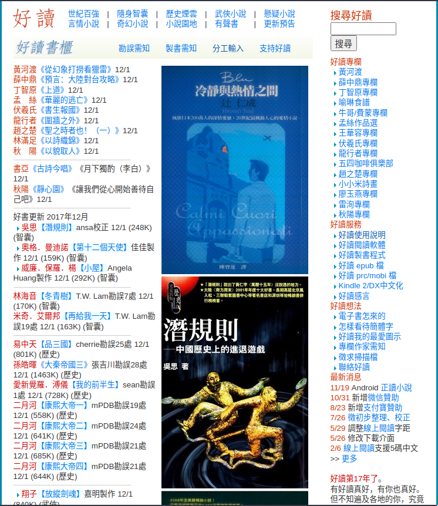
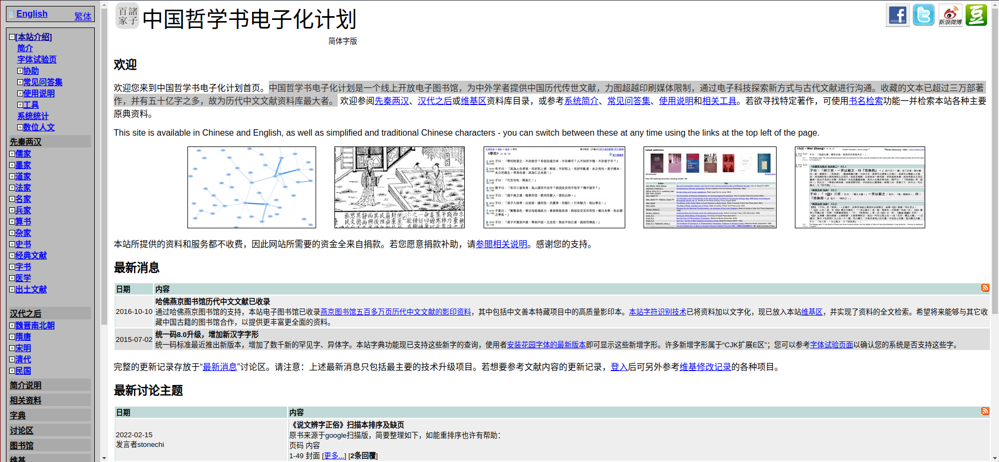
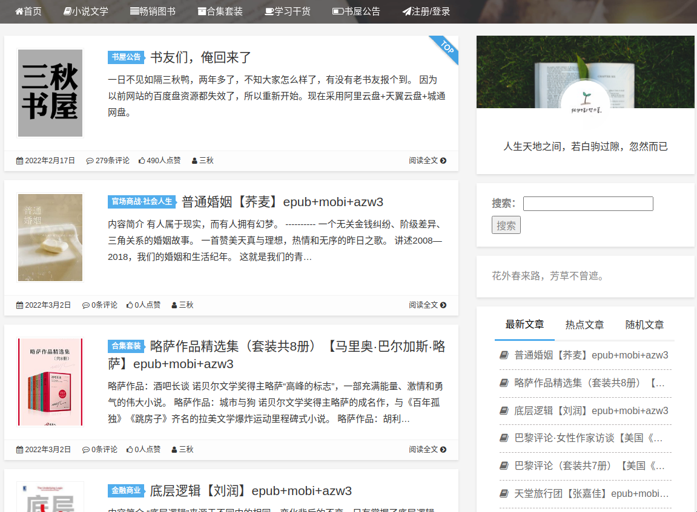
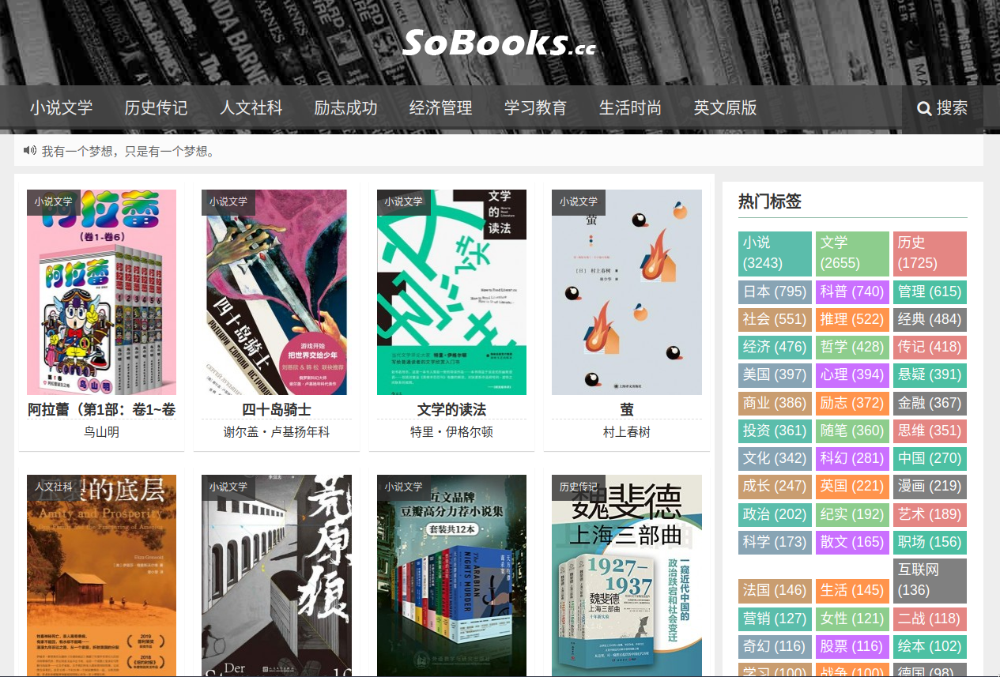

<mark>
本文仅整理了一些中文电子书籍资源获取方式，来源于library genesis论坛中的一个帖子。
我并不完全推荐其中的全部内容，尤其是涉及微信、xx网盘等非自由网络服务的内容。
</mark>

## 好读

[好读](http://www.haodoo.net/)

> 好讀網站是推廣中文電子書的公益網站，是不約而來的一群讀友，為自己也為大家，從2001年建站迄今不斷努力不斷貢獻的成果。好讀網站免費提供您的是：
>
> 1) 好讀中文直式閱讀軟體
> 2) 好讀製書程式 mPDB
> 3) 好讀書櫃﹙整理校正過的好書﹚
>
> 註：整理校正過的書還是會有失誤，要靠讀友經年累月的指正勘誤，品質才能越來越好。

## 中国哲学书电子化计划

[中国哲学书电子化计划](https://ctext.org/zhs)

> 中国哲学书电子化计划是一个线上开放电子图书馆，为中外学者提供中国历代传世文献，力图超越印刷媒体限制，通过电子科技探索新方式与古代文献进行沟通。收藏的文本已超过三万部著作，并有五十亿字之多，故为历代中文文献资料库最大者。

## 三秋书屋

[三秋书屋](https://www.sanqiu.cc/) 提供各类epub+mobi+azw3电子书的网盘下载链接

支持阿里云盘+天翼云盘+城通网盘下载链接

## So Read

[So Read](https://sobooks.cc/)

epub格式电子书

支持蓝奏网盘+城通网盘+备份网盘下载链接

需要关注公众号获取「暗号」下载

## 其他资源和工具等

[鸠摩搜索](https://www.jiumodiary.com/)

[古籍知识图谱检索](https://cnkgraph.com/Book)

[书伴--kindle使用技巧(不提供资源下载)](https://bookfere.com/)

[北大法宝](http://www.pkulaw.cn/)

[国际乐谱库](https://cn.imslp.org/wiki/Main_Page)

## 附原帖中全部链接

http://www.iamtxt.com/e/member/login/log.html

http://ebooks.lib.ntu.edu.tw/Home/ListBooks

https://cn.imslp.org/wiki/Main_Page

https://sou-yun.cn/eBookIndex.aspx

http://bbs.gxsd.com.cn/forum.php

https://www.ituring.com.cn/book

http://ishare.iask.sina.com.cn/

https://ebook.lorefree.com/

http://cn.epubee.com/books/

https://www.xiaobaipan.com/

https://forum.readfree.me/

https://bookfere.com/ebook

https://book.shuyuzhe.com/

http://www.ireadweek.com/

http://book.mybanshu.win/

http://book.chaoxing.com/

http://www.rufengso.net/

https://www.owllook.net/

https://www.soepub.com/

https://www.zqbook.top/

https://www.kgbook.com/

http://www.book118.com/

http://www.guoxue.com/

http://bestcbooks.com/

http://www.pdfbook.cn/

https://www.cn-ki.net/

http://www.pkulaw.cn/

https://ctext.org/zhs

https://ctext.org/zhs

https://ebookbb.com/

http://www.iread.cf/

https://sobooks.cc/

https://www.d4j.cn/

http://haodoo.net/
