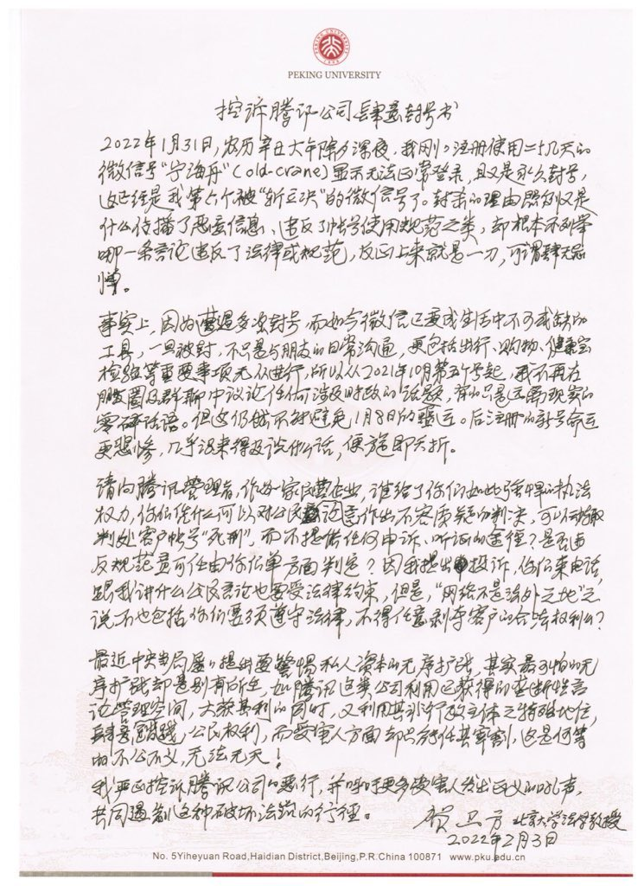

## 微信不是自由软件

[自由软件](https://www.gnu.org/philosophy/)意味着其用户拥有自由（这无关价格）。

具体而言，包括四大自由：

0. 自由运行软件
1. 自由学习和修改软件源代码
2. 自由再发布软件拷贝
3. 自由发布修改后的软件版本。

显然，对于微信的客户端程序来说，用户不具备这四大自由中的任何一项。

这里着重要说一下自由之〇，用户并不能够自由运行微信的客户端程序：

比如，北京大学法学院教授贺卫方先生六度遭遇封号，注册二十几天的微信号“宁海舟”(old-crane)显示无法正常登录，且又是永久封号。

微信离要求最低的自由之〇尚且差距甚远；更不必奢望其具有自由之一、二、三。

四大自由并不是无理的要求。因为只有满足了四大自由，用户才有可能掌控程序；否则，用户只可能被程序所掌控。

关于为什么要使用自由软件，Richard Stallman在[这篇文章](https://www.gnu.org/philosophy/free-software-even-more-important.html)中已经阐述得十分详尽了。可以说微信几乎具有[专有软件所能具有的全部恶意功能](https://www.gnu.org/proprietary/)。

比如，微信官方宣称它们不会查看用户的聊天内容。这就是个天大的笑话！

微信中内置有后门审查用户发送的链接。当然，微信宣称是为了用户的「安全」。
（嗯。对腾讯而言，淘宝、今日头条的链接算得上是「有害内容」啦，的确不「安全」🤔）

而且，会被审查的消息可不只是用户发到微信后台服务器的内容：微信的审查系统是做在APP本地的。
~~如果你发送以`https://youtube.com`开头的链接，
就会发现即使你自己想要长按复制这个链接的文本内容，
微信似乎也不同意：那个「复制」的按钮凭空消失了！~~
我曾经发送以`https://youtube.com`开头的链接到一个<6人的群里，
视频内容是[老高與小茉](https://www.youtube.com/channel/UCMUnInmOkrWN4gof9KlhNmQ)的一期脑洞。
发送之后我发现根本无法复制链接的文本。
同时我又发了一些其他链接，发现能够正常复制文本。
当然，在我写这篇文章时，想要重复实验来验证这个审查机制确实存在，
但这回又正常了。

油管当然有很多邪恶行为，但如果你说访问`youtube.com`是所谓「违法」的话，那就是在搞笑了：

请先把喉舌闭上吧！ https://www.youtube.com/c/cctv

## 微信在推广中心化的网络服务

微信的网络服务是中心化的，而中心化的网络结构是糟糕的。

首先，它很脆弱。中心化网络中，如果中心节点出了问题，整个网络都会瘫痪。只要时间够长，出问题就是必然事件。事实上，微信已经有过大面积故障的情况发生了，将来也一定会再次发生的。我是认为把重要的东西放在微信上是极其愚蠢的。而事实上我们有大量的社交、金钱等依托于这个脆弱的平台。
包括支付宝等也是一样的。不管它宣传说自己什么「两地三中心」、「三地五中心」...哪怕「三百地五百中心」，只要有个中心，这个网络结构都可以被”一勺烩”，我特别喜欢引用《庄子·胠箧》里的这个譬喻：

> 将为胠箧、探囊、发匮之盗而为守备，则必摄缄縢、固扃鐍；此世俗之所谓知也。然而巨盗至，则负匮、揭箧、担囊而趋；唯恐缄縢扃鐍之不固也。然则乡之所谓知者，不乃为大盗积者也？

中心化网络下所谓的「安全」，到头来终将是为他人作嫁衣裳。

另外，中心化网络势必会产生垄断。当然这一点是微信所乐见的，但对于除了微信掌控者之外的其他所有人来说，都不是个好事。

## 微信不是端到端加密的即时通信服务

这里的「端到端加密」，意思是只有发送者和接受者能够看到消息的明文，其他任何人即便拿到数据也都是加密后的密文，无法知晓通信的内容。

显然，微信能够进行那么多肆无忌惮的审查操作，不可能提供端到端加密的功能。

其实采用端到端加密的一个重要目的，也就是为了避免类似微信这种审查行为。

## 替代方案有哪些？

非自由软件、中心化、非端到端加密这三项设计上的缺陷是微信如此糟糕的根本原因；而严苛的互联网审查制度只是个放大镜，让人们更清楚地看到其危害。

一个好的微信替代品必须是一个自由的、去中心化、支持端到端加密的即时通讯协议，并且客户端和服务端软件要是自由软件。

因此，类似于Line、WhatsApp、KakaoTalk之类的软件首先要被淘汰。它们和微信的区别可能仅仅是审查行为没有那么明显罢了，本质上是一样的。

有人可能会说Telegram好一些；它的确有自由软件的客户端，但它的服务仍是中心化的，服务端仍然是专有软件，并且不支持端到端加密。

## XMPP

[XMPP](https://xmpp.org/)是真正能够替代微信的东西。它其实只是一套开放的标准，定义了即时通信应用该如何工作，仅此而已。就像电子邮件和Web网页一样──我们有各式各样的电子邮箱服务提供者、各式各样的email客户端，形形色色的网站、也有各种浏览器──XMPP协议也有各种服务端和客户端的实现。

对于客户端软件：

在Android上，可以使用[Conversations](https://conversations.im/)

在iOS上，可以使用[Monal](https://monal.im/)或[Siskin](https://siskin.im)

甚至在浏览器上，也可以使用[Converse](https://conversejs.org/)

在[这里你还能找到更多出色的XMPP客户端](https://xmpp.org/software/clients/)

对于服务端：

类似于电子邮箱──有人选择付费服务，有人选择免费服务，有人选择自己搭建服务──XMPP也有各式各样的服务提供者，你也可以自己搭建一个自己的XMPP服务器。

在[Conversations](https://conversations.im/)提供的[兼容性测试页面](https://compliance.conversations.im/)上，可以找到目前因特网上公开的XMPP服务器，如[这个连接](https://compliance.conversations.im/test/xep0384/)显示了各个服务器是否实现了OMEMO(端到端加密)。

你也可以参考[这里列出的服务端软件](https://xmpp.org/software/servers/)自己搭一个XMPP服务器。我使用的是[Prosody IM](https://prosody.im/)，简单高效，非常好用。

## Matrix

[Matrix](https://matrix.org) 也是一个满足自由软件、去中心化、端到端加密要求的即时通信协议。同样有许许多多的客户端实现。但它的服务端目前主要使用的是Synapse，也是自由软件，不过它的服务端运行时消耗的计算资源相当多，我曾在自己的小vps中尝试运行过Synapse，程序经常崩溃，CPU占用也相当大（也可能是因为当时还不太完善），于是后来我就没有再尝试了。

不过总体而言客户端的体验可能比XMPP要更友好一些。
